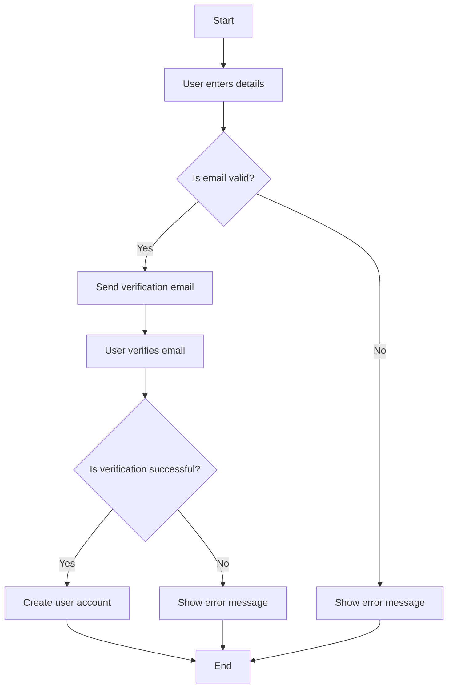
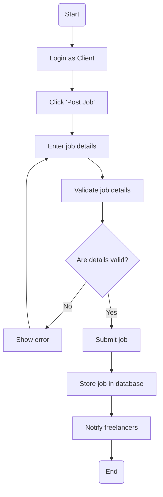
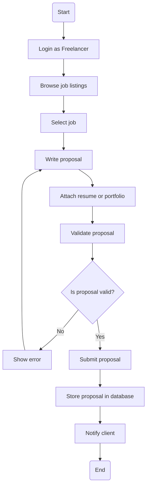
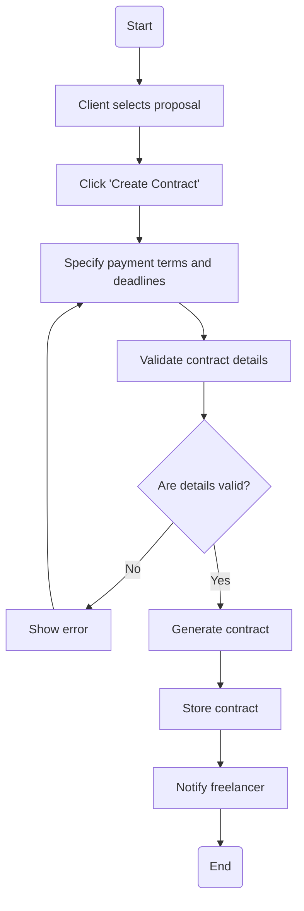
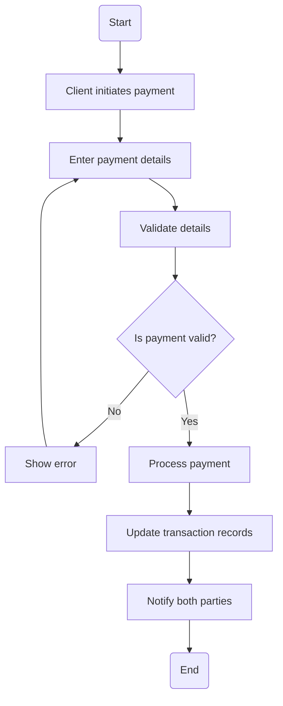
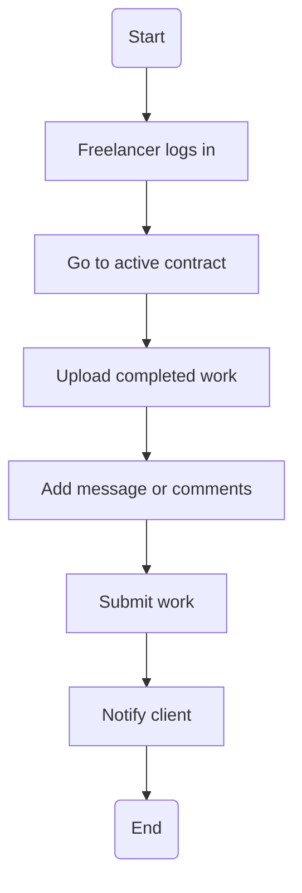
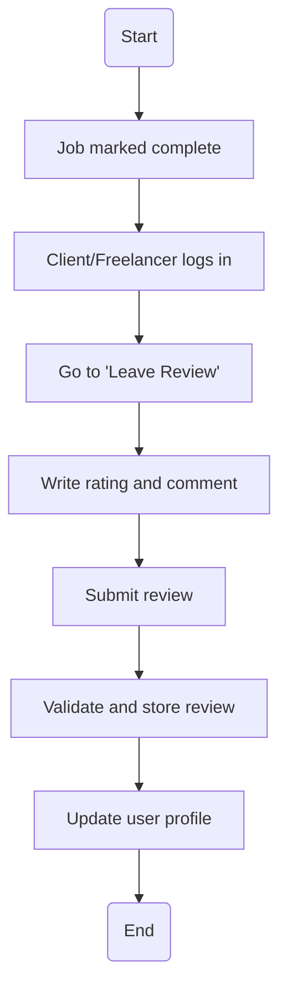

## 1. User Registration - Activity Diagram

## Explanation

This workflow shows the full process a user follows when registering. It includes validation, email verification, and account activation. Ensuring only verified users become active aligns with system security and integrity requirements, and supports the functional requirement for account creation.

---
## 2. Post Job Workflow

## Explanation
This diagram outlines how clients post jobs. Validation ensures complete and correct job listings. Freelancers are notified, supporting the platform’s goal of quick and relevant job exposure. This ties into requirements for job posting and system notification functionalities.

---
## 3. Submit Proposal Workflow


## Explanation 
This workflow helps freelancers apply for jobs. Validation prevents incomplete submissions. Notifying clients ensures fast proposal review, supporting agile response times and enhancing platform usability and responsiveness.

## 4. Create Contract Workflow

## Explanation

This flow covers creating a contract between a client and freelancer. Validating terms ensures fairness and prevents errors. Notifying the freelancer helps initiate project work promptly, which supports system efficiency and agreement traceability.


## 5. Payment Processing Workflow


## Explanation
This diagram models the payment workflow, focusing on accuracy, validation, and notifications. It aligns with the requirement for secure, traceable financial transactions. This also builds trust and supports real-time payment tracking.


## 6. Deliver Work Workflow

## Explanation
This diagram highlights how freelancers submit deliverables. Optional messaging fosters communication. Notifying the client ensures timely review, enhancing collaboration and meeting the platform’s delivery-tracking requirement.

---
## 7. Leave Review Workflow

## Explanation
This activity covers the feedback loop, crucial for credibility and trust. Reviews are validated and stored, and profiles updated to reflect performance. This supports platform transparency and enhances decision-making for future collaborations.


## 8. Report Issue Workflow

```mermaid
flowchart TD
    A(Start) --> B[Login]
    B --> C[Go to "Report Issue"]
    C --> D[Select issue type]
    D --> E[Describe problem]
    E --> F[Attach evidence (optional)]
    F --> G[Submit report]
    G --> H[Store report and alert admin]
    H --> I(End)
```
## Explanation
This flow gives users a way to report problems. Attaching evidence helps the admin assess the issue quickly. It supports the system’s requirement for support and conflict resolution, ensuring user protection and platform integrity.


