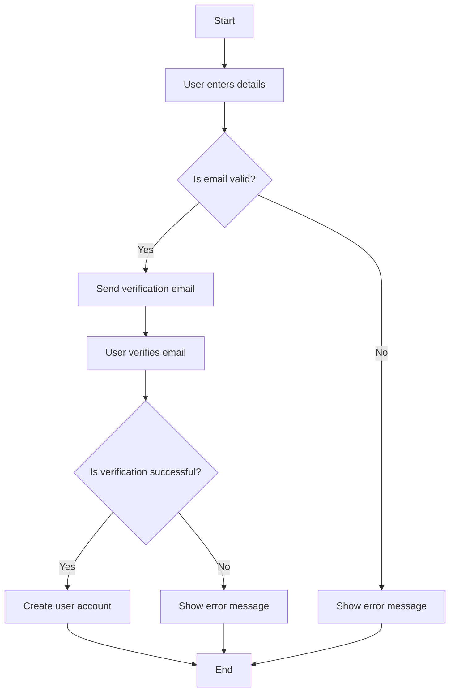
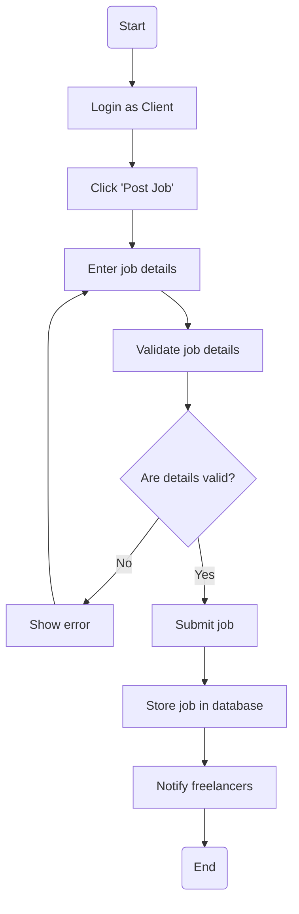
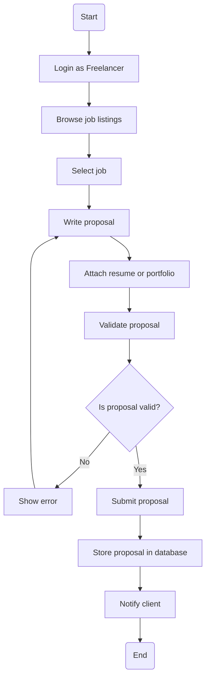

## 1. User Registration - Activity Diagram

## User Registration - Activity Diagram Explanation

This workflow shows the full process a user follows when registering. It includes validation, email verification, and account activation. Ensuring only verified users become active aligns with system security and integrity requirements, and supports the functional requirement for account creation.

---
## 2. Post Job Workflow

## Explanation
This diagram outlines how clients post jobs. Validation ensures complete and correct job listings. Freelancers are notified, supporting the platform’s goal of quick and relevant job exposure. This ties into requirements for job posting and system notification functionalities.

---
## 3. Submit Proposal Workflow

## Explanation 
This workflow helps freelancers apply for jobs. Validation prevents incomplete submissions. Notifying clients ensures fast proposal review, supporting agile response times and enhancing platform usability and responsiveness.

