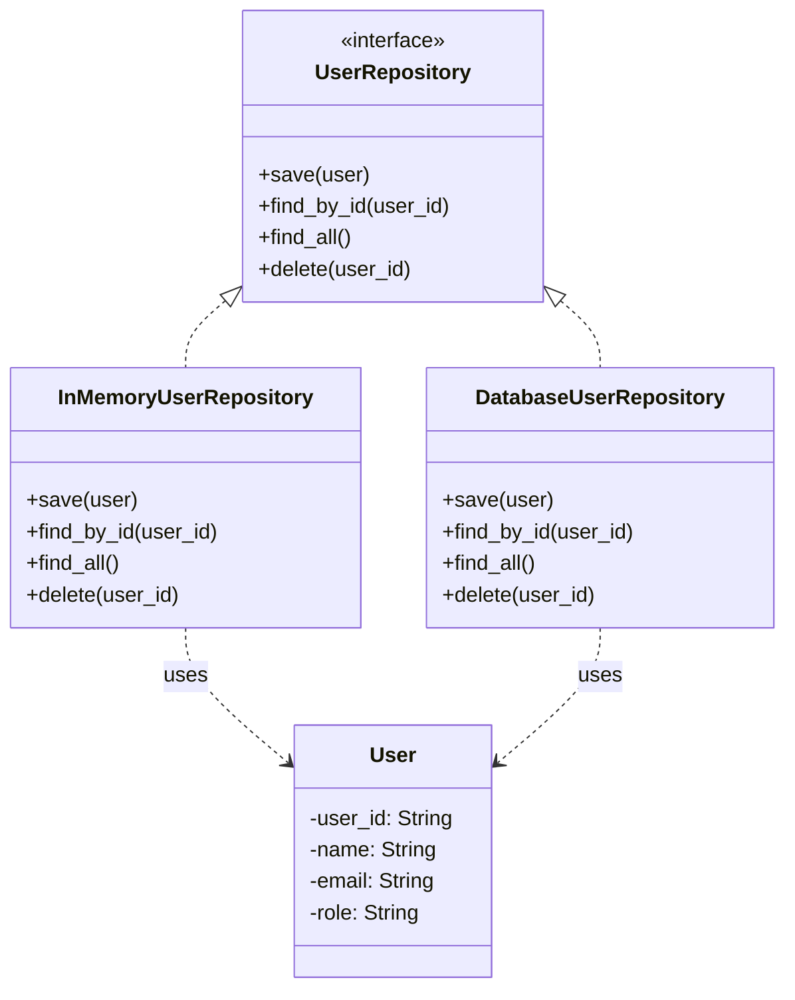

```mermaid
classDiagram
class User {
  -user_id: String
  -name: String
  -email: String
  -role: String
}

class UserRepository {
  <<interface>>
  +save(user)
  +find_by_id(user_id)
  +find_all()
  +delete(user_id)
}

class InMemoryUserRepository {
  +save(user)
  +find_by_id(user_id)
  +find_all()
  +delete(user_id)
}

class DatabaseUserRepository {
  +save(user)
  +find_by_id(user_id)
  +find_all()
  +delete(user_id)
}

UserRepository <|.. InMemoryUserRepository
UserRepository <|.. DatabaseUserRepository
InMemoryUserRepository ..> User : uses
DatabaseUserRepository ..> User : uses
```
