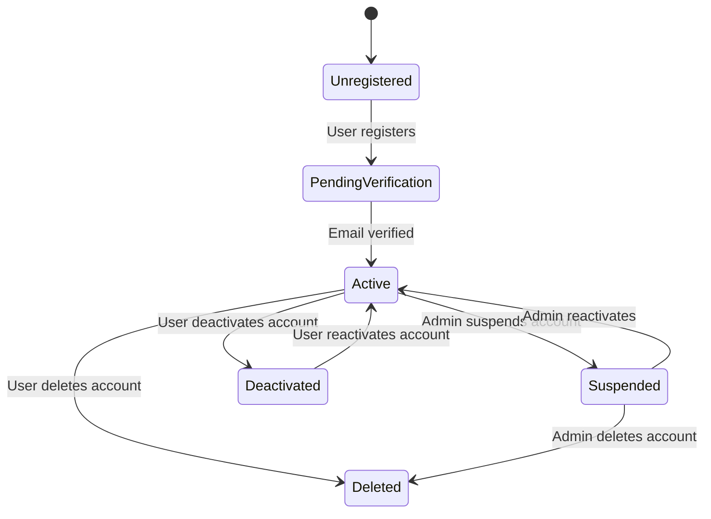
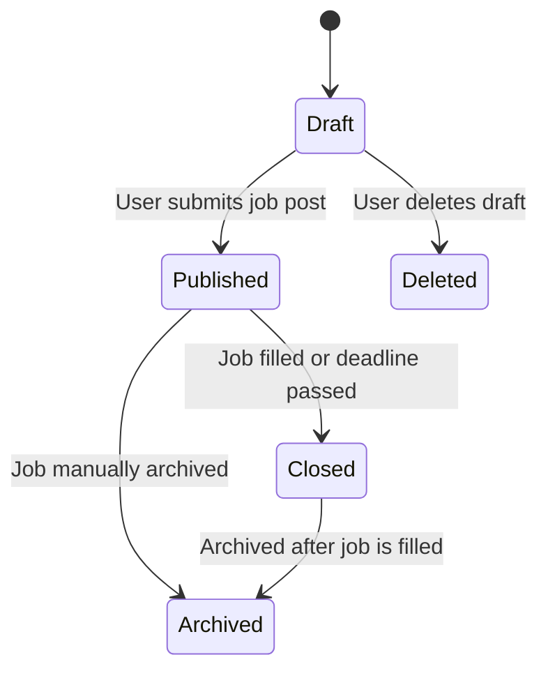
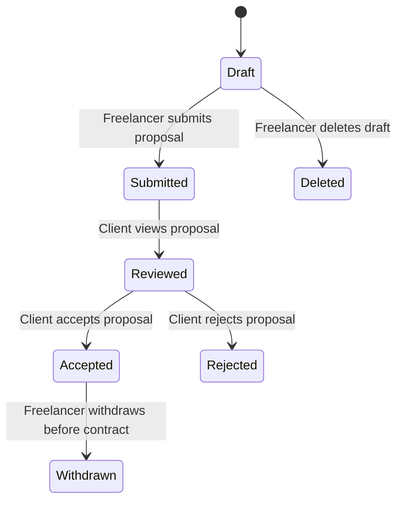
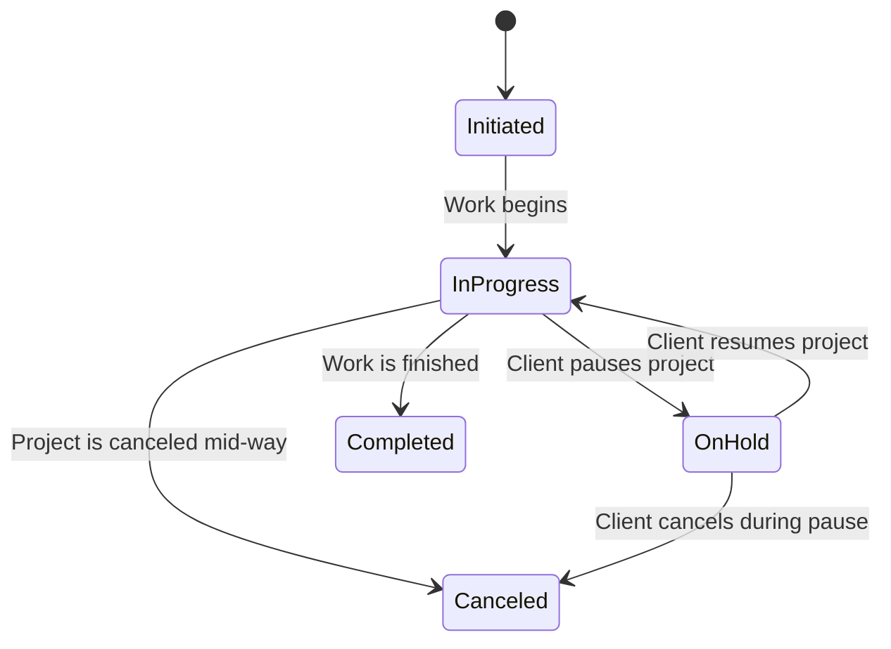
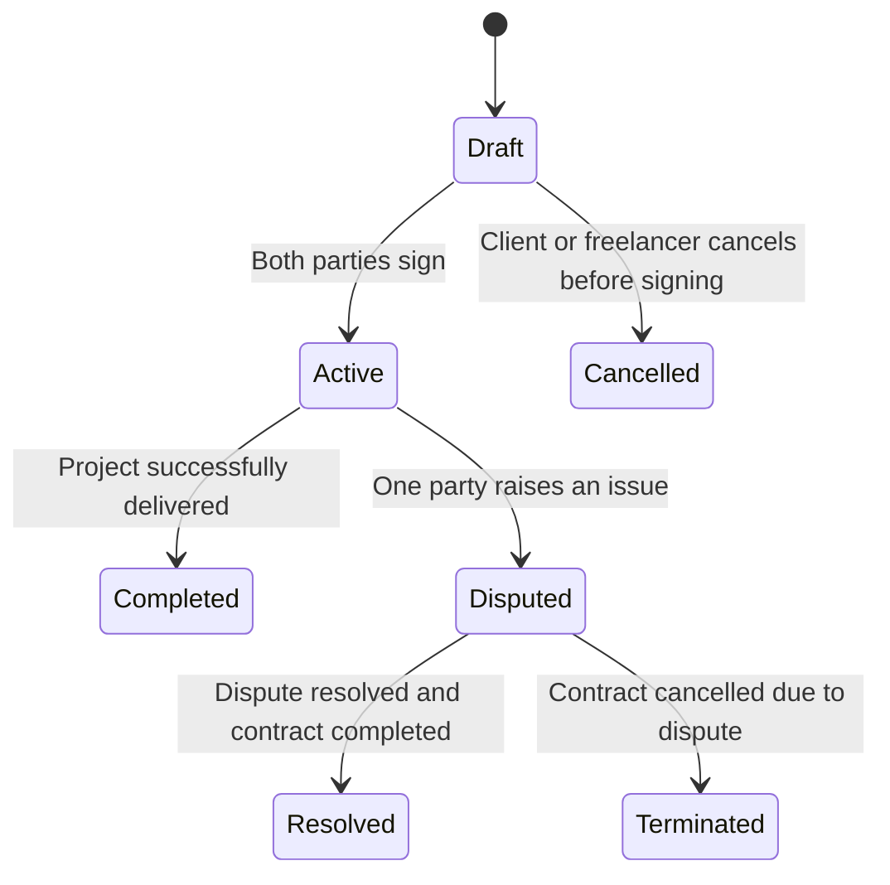
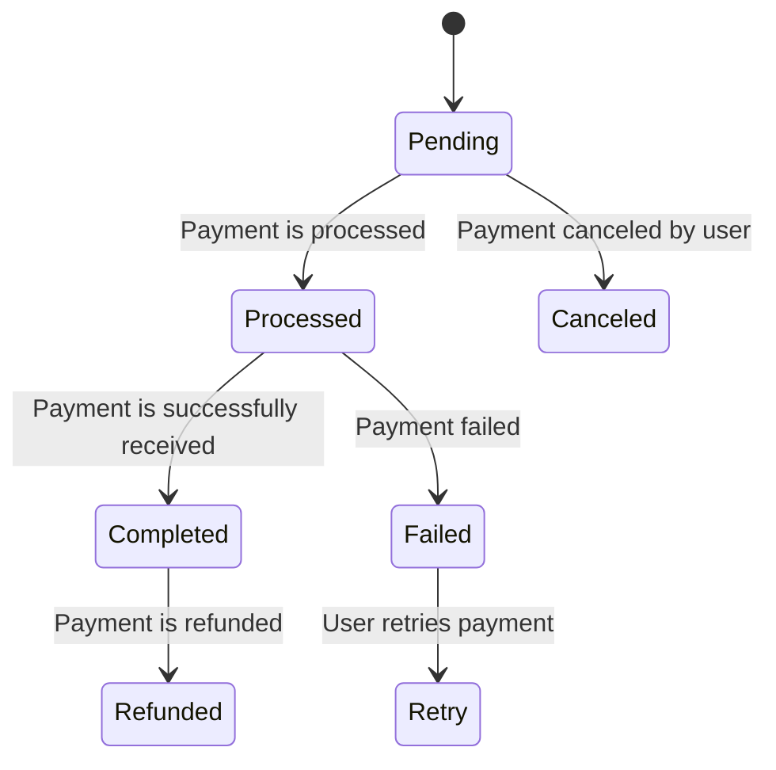
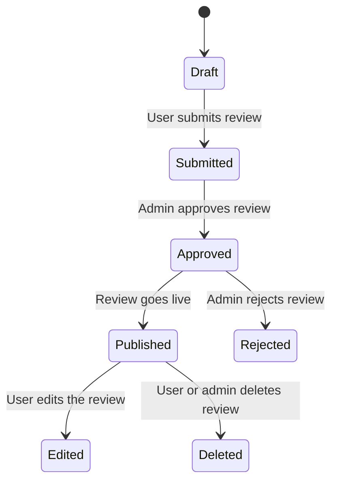
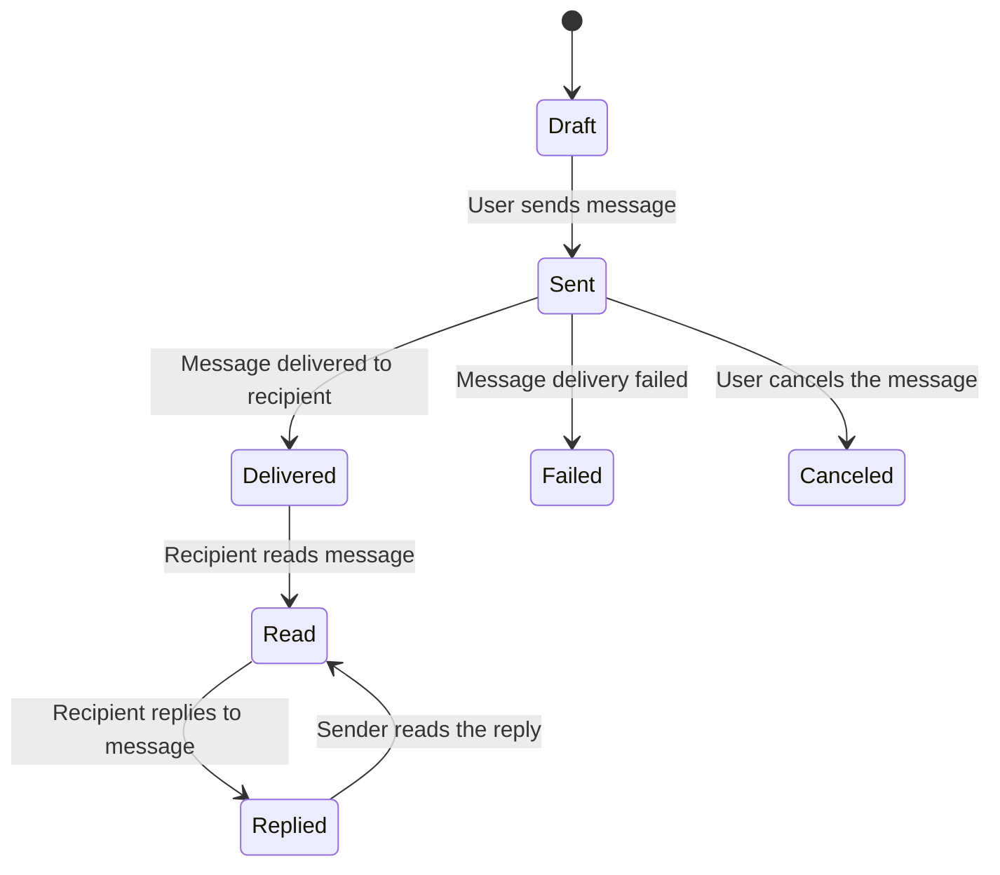

## 1. User Account - State Transition Diagram

### User Account - State Diagram Explanation

This diagram shows the different stages a user account can go through on the platform.

- A user starts as **Unregistered**, then registers and enters **Pending Verification**.
- After verifying their email, the account becomes **Active**.
- The account can be **Suspended** by an admin, **Deactivated** by the user, or permanently **Deleted**.
- Users can also reactivate their accounts after deactivation.

## 2. Job Post - State Transition Diagram

## Job Post - State Diagram Explanation

This diagram shows the lifecycle of a Job Post on the platform.

- A job starts as a Draft and moves to Published when submitted.

- Once a job is filled or expires, it transitions to Closed.

- From there, it may be Archived for future reference.

- Users can also delete a job while it's still in draft mode.

## 3. Proposal - State Transition Diagram

## Proposal - State Diagram Explanation

This diagram represents the states a Proposal goes through from creation to decision.

- A proposal begins as a Draft, then moves to Submitted when sent.

- The client then Reviews the proposal and either Accepts or Rejects it.

- If accepted, the freelancer can still Withdraw the proposal before a contract is signed.

- Drafts can also be Deleted by the freelancer before submission.

## 4. Project - State Transition Diagram

## Project - State Diagram Explanation

This diagram illustrates the lifecycle of a Project from start to finish.

- A project starts as Initiated, then moves to In Progress when the freelancer begins working.

- It can be Paused (On Hold) by the client and later resumed.

- Once the work is done, the project moves to Completed.

- Projects can also be Canceled either mid-way or while on hold.

## 5. Contract - State Transition Diagram

## Contract - State Diagram Explanation

This diagram defines how a Contract progresses through the system.

- Starts in Draft, becomes Active once both parties agree.

- From Active, it can move to Completed if delivered, or Disputed if issues arise.

- Disputes can be either Resolved or lead to Termination.

- Drafts can also be Cancelled if either party backs out before signing.

## 6. Payment - State Transition Diagram

## Payment - State Diagram Explanation

This diagram outlines the lifecycle of a Payment.

- Payments begin in Pending, and once processed, they can either be Completed or Failed.

- Failed payments can be retried, while completed payments can later be Refunded.

- Users also have the option to cancel the payment while it’s still in the pending state.

## 7. Review - State Transition Diagram

## Review - State Diagram Explanation

This diagram defines the lifecycle of a Review.

- A review starts in Draft, and once submitted, it moves to Submitted.

- Admin approval is needed for it to be Approved and then Published.

- Reviews can also be Rejected by admins or Edited by the user after publication.

- Both users and admins can Delete reviews.

## 8. Message - State Transition Diagram

## Message - State Diagram Explanation

This diagram outlines the lifecycle of a Message.

- A message begins as a Draft, then gets Sent by the user.

- Once sent, it moves to Delivered, and if read, it becomes Read.

- After reading, the recipient can Reply, and the sender can read the response.

- Messages can also Fail to deliver or be Canceled before sending.

