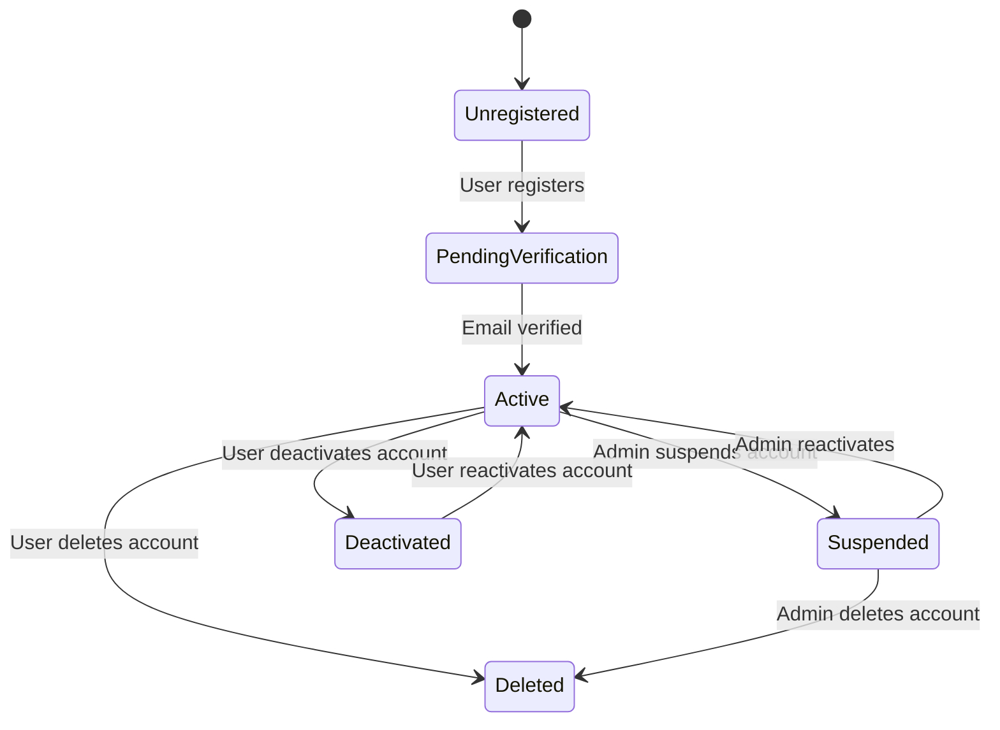
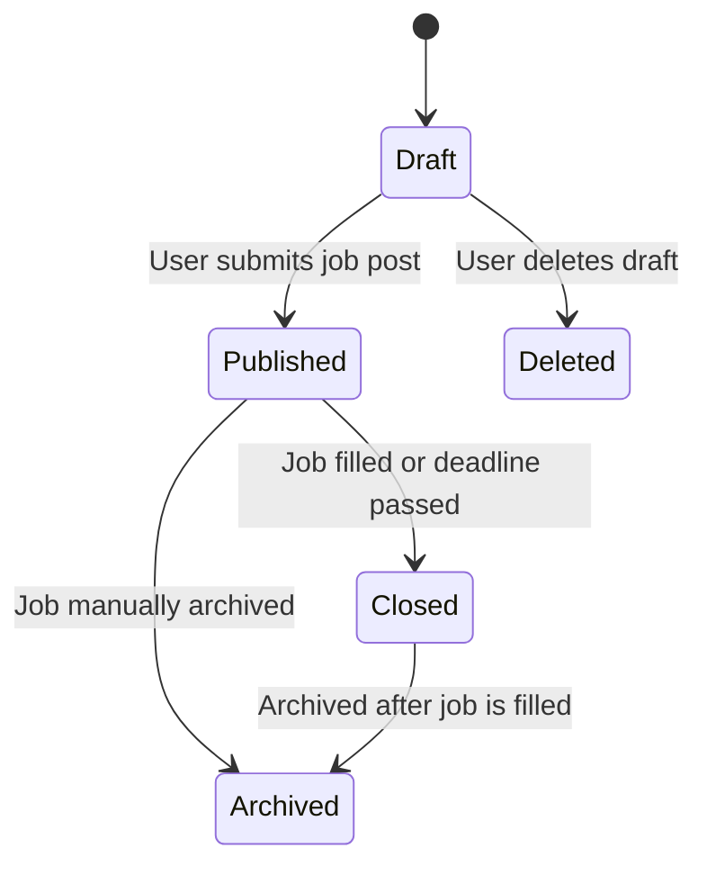

## 1. User Account - State Transition Diagram

### User Account - State Diagram Explanation

This diagram shows the different stages a user account can go through on the platform.

- A user starts as **Unregistered**, then registers and enters **Pending Verification**.
- After verifying their email, the account becomes **Active**.
- The account can be **Suspended** by an admin, **Deactivated** by the user, or permanently **Deleted**.
- Users can also reactivate their accounts after deactivation.

## Job Post - State Transition Diagram

## Job Post - State Diagram Explanation
This diagram shows the lifecycle of a Job Post on the platform.

A job starts as a Draft and moves to Published when submitted.

Once a job is filled or expires, it transitions to Closed.

From there, it may be Archived for future reference.

Users can also delete a job while it's still in draft mode.
