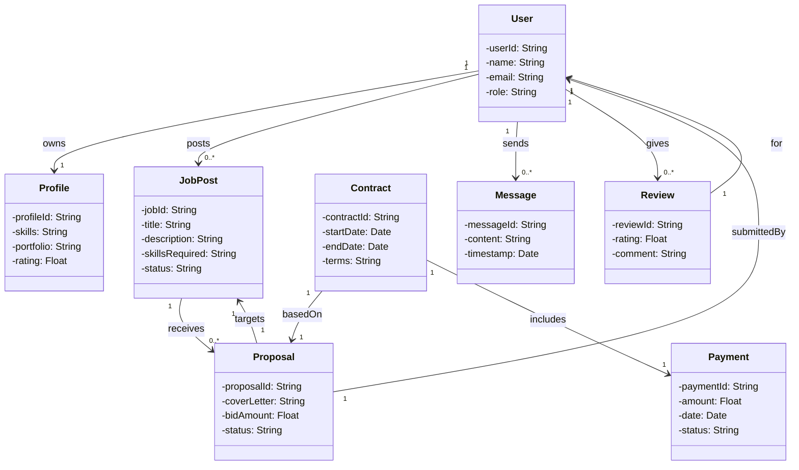

```mermaid
classDiagram
class User {
  -userId: String
  -name: String
  -email: String
  -role: String
}

class Profile {
  -profileId: String
  -skills: String
  -portfolio: String
  -rating: Float
}

class JobPost {
  -jobId: String
  -title: String
  -description: String
  -skillsRequired: String
  -status: String
}

class Proposal {
  -proposalId: String
  -coverLetter: String
  -bidAmount: Float
  -status: String
}

class Contract {
  -contractId: String
  -startDate: Date
  -endDate: Date
  -terms: String
}

class Message {
  -messageId: String
  -content: String
  -timestamp: Date
}

class Review {
  -reviewId: String
  -rating: Float
  -comment: String
}

class Payment {
  -paymentId: String
  -amount: Float
  -date: Date
  -status: String
}

User "1" --> "1" Profile : owns
User "1" --> "0..*" JobPost : posts
User "1" --> "0..*" Message : sends
User "1" --> "0..*" Review : gives
JobPost "1" --> "0..*" Proposal : receives
Proposal "1" --> "1" User : submittedBy

Proposal "1" --> "1" JobPost : targets
Contract "1" --> "1" Proposal : basedOn
Contract "1" --> "1" Payment : includes
Review "1" --> "1" User : for

```
